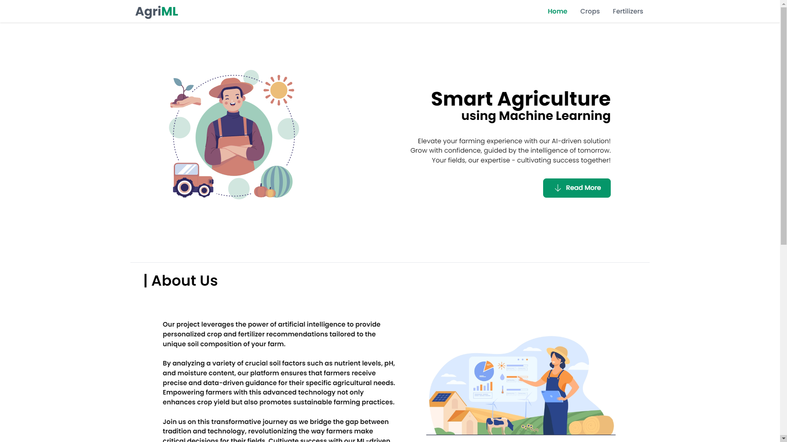
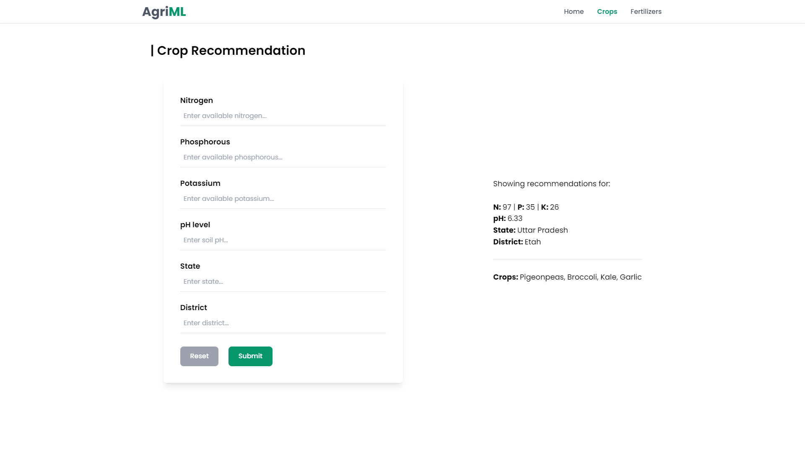
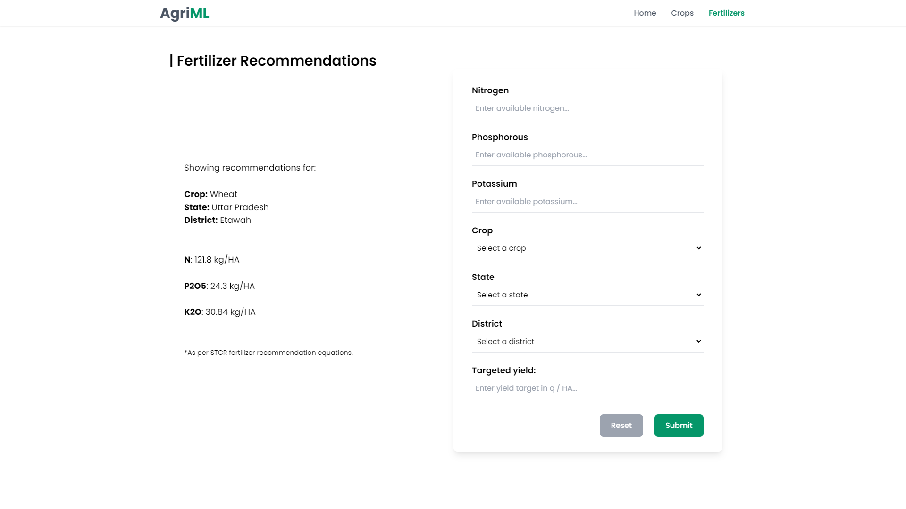

# AgriML

<br/>
AgriML is a web-based application of machine learning in the field of agriculture to provide personalized crop and fertilizer recommendations tailored to the unique soil composition of the farm.<br/>
The project leverages the power of machine learning and data science to enhance crop yield by analyzing the data and research done by established authorities.

## Key Features
- Web-based application for ease of use.
- Minimal and responsive UI/UX.
- Multiple crop recommendations based on soil parameters.
- Precise fertilizer recommendation based on ICAR-IISS report on STCR.

## Technologies Used
- **Frontend:** React JS + Vite, Tailwind CSS, React-Router
- **API:** Flask API
- **Backend:** Python, NumPy, Pandas, Scikit-learn

### Getting started:
- Fork and Clone the repo using:
```
$ git clone https://github.com/paraschandra/AgriML.git
```
- Change the directory to frontend and install dependencies using:
```
$ npm i
```
- Now, change the directory to the backend and install all Python packages using:
```
$ pip install {package-name}
```
- Start the server by running `app.py`
- Run the web application at http://localhost:5173 using:
```
$ npm run dev
```

## Screenshots






## Contributors
<a href="https://github.com/paraschandra/AgriML/graphs/contributors">
  
</a> Paras Chandra
<a href="https://github.com/purucool/">
  
</a> Purushottam Varshney
